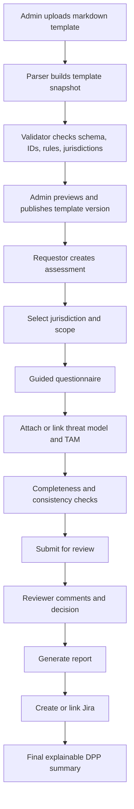
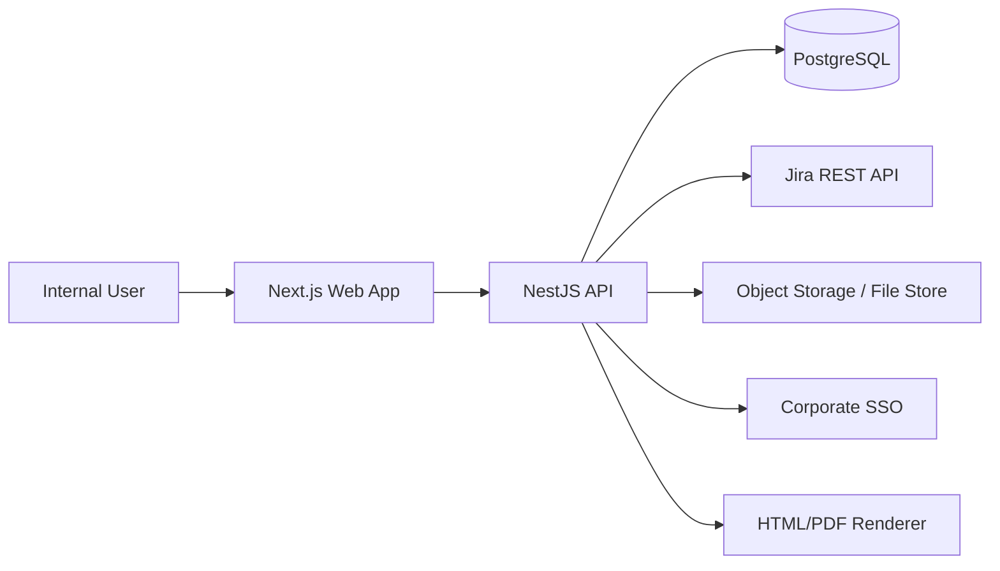

# DPP Assessment Platform Design

## 1. Product Definition

### Purpose

Build an internal SAP Fioneer-style application that replaces a confusing Excel-based DPP assessment with a guided, auditable, markdown-driven workflow. The platform should help delivery teams answer correctly, preserve the exact version of the assessment content used, incorporate threat modelling and TAM evidence, and produce an explainable DPP coverage summary with reviewer oversight.

### Target Users

| User type | Needs |
| --- | --- |
| Requestor / product owner | Start an assessment quickly, understand what information is needed, link to Jira, track status |
| Delivery engineer / architect | Provide accurate answers, attach TAM and threat model evidence, save drafts |
| Privacy assessor / DPP reviewer | Review answers, spot gaps, request clarifications, generate reports |
| Security architect | Validate threat model quality, architecture consistency, trust boundaries, data flows |
| Approver / governance lead | See a concise recommendation, rationale, residual risks, and audit trail |
| Template admin | Maintain markdown templates, jurisdictions, rules, and guidance without breaking history |

### Current Excel Pain Points

- Users interpret checklist questions inconsistently.
- Excel provides little context on why a question matters.
- Guidance, examples, and jurisdiction applicability are missing or buried in tribal knowledge.
- Threat modelling and TAM evidence are external and not traceably tied to answers.
- No controlled versioning of question sets or rules.
- Review comments, approvals, and Jira linkage are fragmented.
- Reports are manual and inconsistent.

### Goals

- Treat markdown as the canonical assessment source.
- Provide guided, plain-English question answering with inline help and examples.
- Version templates, rules, and rendered question snapshots for full traceability.
- Make threat modelling and TAM evidence first-class workflow inputs.
- Produce explainable jurisdiction-aware summaries and professional reports.
- Support enterprise governance: SSO, RBAC, audit logging, change history, approvals.

### Non-Goals

- Fully automated legal/compliance sign-off without reviewer involvement.
- Replacing Jira or document management systems.
- Free-form template authoring directly in the UI as the primary authoring mode.
- Running advanced diagram analysis in the MVP.

## 2. Markdown-Driven Assessment Design

### Core principle

The markdown file is the source of truth for the assessment structure and question content. The system parses markdown into a normalized template snapshot, but the source markdown, checksum, parsed JSON, and validation output are stored together for each template version.

### Recommended approach

Use two supported input modes:

1. `Legacy checklist mode`
   - Supports the current markdown format with headings and task-list questions.
   - Useful for immediate ingestion with minimal editorial change.
   - Generates default boolean questions with generated section ordering.

2. `Governed template mode`
   - Adds frontmatter and structured per-question metadata blocks.
   - Enables stable IDs, help text, examples, jurisdiction tags, conditional logic, evidence requirements, and requirement mapping.
   - Should become the operational standard for future template versions.

### Markdown Conventions

#### Template-level frontmatter

Use YAML frontmatter for versioned template metadata:

```yaml
---
template_key: dpp_privacy_checklist
version: 1.0.0
title: Privacy & Data Protection Compliance Checklist
status: active
source_type: governed
source_markdown_path: templates/privacy_compliance_checklist.enriched.v1.md
jurisdictions:
  - code: EU_GDPR
    label: EU GDPR
  - code: UK_GDPR
    label: UK GDPR
owners:
  - privacy-office
review_roles:
  - requestor
  - privacy_assessor
  - security_architect
checksum_algorithm: sha256
---
```

#### Section representation

- `##` headings define sections.
- An optional `dpp-section` fenced block directly below the heading defines metadata.

Example:

````md
## Personal Data Processing - Direct Identifiers

```dpp-section
key: direct_identifiers
description: Detect whether direct identifiers are processed anywhere in the solution lifecycle.
help:
  summary: Include production, support, analytics, logs, and realistic test data.
maps_to:
  - EU_GDPR:ART_4_PERSONAL_DATA
```
````

#### Question representation

- `###` heading defines the visible question prompt.
- Stable key is required in governed mode via inline token `{#QUESTION_ID}`.
- An immediately following `dpp-question` fenced YAML block stores structured metadata.

Example:

````md
### Does your product process names of natural persons? {#PDP_DI_001}

```dpp-question
response_type: boolean
required: true
jurisdictions: [EU_GDPR, UK_GDPR]
why_it_matters: Names are direct personal identifiers and usually make personal-data handling obligations applicable.
guidance:
  plain_english: Answer yes if legal names, display names, or contact names are stored, transmitted, exported, or logged.
  prompts:
    - Consider support tooling and audit exports.
    - Consider seeded test data if it contains realistic personal names.
examples:
  good:
    - Customer onboarding stores account holder first and last name in the policy record.
  bad:
    - Users exist in the product.
evidence:
  recommended:
    - tam_diagram
    - data_inventory
requirement_refs:
  - EU_GDPR:ART_4_PERSONAL_DATA
  - UK_GDPR:ART_4_PERSONAL_DATA
decision_effects:
  yes_sets_flags:
    - personal_data_present
```
````

#### Help text and examples

- Keep prose in markdown, but store machine-readable semantics in the `dpp-question` block.
- Support:
  - `why_it_matters`
  - `guidance.plain_english`
  - `guidance.prompts`
  - `examples.good`
  - `examples.bad`
  - `references`

#### Jurisdiction applicability

- At template level: supported jurisdictions.
- At question level: `jurisdictions: [EU_GDPR, UK_GDPR]`.
- At requirement level: `requirement_refs`.
- At rule level: jurisdiction-scoped outcomes or reviewer alerts.

#### Threat modelling / TAM requirements

Represent them in two ways:

- `evidence.recommended` or `evidence.required`
- question and section tags such as `depends_on_architecture: true`

Example:

```yaml
evidence:
  required:
    - threat_model
    - tam_diagram
consistency_checks:
  - must_reference_data_store_if_answer_true
```

#### Conditional logic

Keep logic declarative and explainable:

```yaml
display_rules:
  all:
    - fact: personal_data_present
      equals: true
    - jurisdiction_in: [EU_GDPR, UK_GDPR]
validation_rules:
  - type: required_when_displayed
```

Conditions should only reference:

- prior question IDs
- derived flags
- jurisdiction selection
- assessment scope metadata

Avoid arbitrary code execution in templates.

#### Mandatory vs optional

- `required: true | false`
- `required_reason`
- `validation_rules`

Optional questions can still influence confidence or reviewer prompts.

#### Stable IDs and keys

- Template: `template_key`
- Section: `key`
- Question: inline `{#QUESTION_ID}` token
- Requirement refs: `JURISDICTION:REQUIREMENT_CODE`
- Rule IDs: generated from template key + question ID + rule name

IDs must never be recycled across materially different questions.

#### Versions

Store:

- semantic version from frontmatter
- source markdown blob
- source checksum
- parsed JSON snapshot
- validation result snapshot
- publication status

Historic assessments always reference `template_version_id`, never only `template_key`.

### Proposed Markdown Schema Summary

| Layer | Mechanism | Required |
| --- | --- | --- |
| Template metadata | YAML frontmatter | Yes |
| Section label | `## Heading` | Yes |
| Section metadata | `dpp-section` fenced YAML | No |
| Question text | `### Heading {#ID}` | Yes in governed mode |
| Question metadata | `dpp-question` fenced YAML | Yes in governed mode |
| Notes / references | normal markdown paragraphs and lists | Optional |

### Safe and reliable parsing

- Parse markdown using `remark` AST, not regex-only parsing.
- Parse frontmatter with `gray-matter`.
- Parse YAML metadata blocks with strict schema validation.
- Sanitize markdown before rendering help text or report snippets.
- Reject unknown required schema versions or duplicate IDs.
- Persist the raw markdown even when parsing fails, so admins can fix templates with full traceability.

### Runtime JSON shape

The parser should emit a normalized template object with immutable IDs, stable ordering, and resolved defaults. See [docs/example-parsed-template.json](/c:/Users/warre/Downloads/DPP/docs/example-parsed-template.json).

## 3. Functional Requirements

### Assessment lifecycle

- Create assessment from a chosen template version.
- Select one or more jurisdictions.
- Capture assessment scope metadata: product name, owner, deployment model, data categories, reviewer assignments.
- Save drafts automatically.
- Submit for review and lock user answers except for requested changes.
- Generate versioned report snapshots.

### Template management

- Upload markdown template or register file from approved repository.
- Parse, validate, preview, publish, retire.
- Track versions, checksums, validation messages, and publish status.
- Compare versions to show changed questions and changed rules.

### Guided questionnaire

- Display one section/question at a time or section-scoped wizard.
- Show plain-English help, why-it-matters text, and examples.
- Ask clarifying follow-up questions when a risky answer is given.
- Highlight unanswered mandatory questions and missing evidence.

### Threat model and TAM integration

- Require upload or link to threat model and TAM diagram when relevant.
- Capture structured metadata: artifact URL, version, owner, review date.
- Run consistency prompts based on architecture answers.

### Reviewer workflow

- Inline comments per question.
- Review decisions: approved, changes requested, blocked.
- Final recommendation with rationale and residual risks.

### Reporting and Jira

- Generate HTML and PDF reports from a structured report model.
- Create Jira issue from assessment or link existing issue.
- Preserve synchronized metadata and audit all sync operations.

### Search and history

- List assessments with status, jurisdiction, owner, Jira key, and last activity.
- Filter by product, team, reviewer, jurisdiction, template version, or final status.
- View historical template snapshots and historical reports.

## 4. Non-Functional Requirements

| Category | Requirement |
| --- | --- |
| Security | SSO, RBAC, encrypted transport, secure secrets handling, attachment malware scanning if uploads are allowed |
| Authorization | Role-based and object-level permissions, reviewer assignment constraints |
| Data protection | Encrypt sensitive fields at rest where appropriate, data minimization, retention policies |
| Audit logging | Immutable audit trail for template publication, answer changes, status transitions, Jira sync, report generation |
| Scalability | Support hundreds to low thousands of assessments and template versions without redesign |
| Maintainability | Strong typing, modular services, versioned contracts, markdown linting, testable rules |
| Accessibility | WCAG 2.1 AA baseline, keyboard navigation, semantic forms, high contrast support |
| Performance | Sub-second question navigation, under 3 seconds for typical report HTML generation |
| Reliability | Draft autosave, optimistic concurrency for answers, idempotent Jira sync requests |
| Enterprise readiness | Monitoring, backup strategy, disaster recovery, configurable retention, environment promotion controls |

## 5. Domain Design

| Entity | Purpose | Core fields | Relationships |
| --- | --- | --- | --- |
| Assessment | Versioned record of one completed or in-progress assessment | id, templateVersionId, status, productName, summary, createdBy, submittedAt | belongs to template version, has many answers, comments, approvals, evidence items, Jira links, reports |
| Assessment Template | Logical template family | id, templateKey, name, owningTeam, status | has many template versions |
| Template Version | Immutable version of markdown-driven content | id, templateId, version, sourceMarkdown, checksum, parsedJson, validationStatus, publishedAt | has many sections, questions, rules snapshots |
| Markdown Source | Original uploaded file metadata | id, templateVersionId, filename, contentType, blobPath, checksum | belongs to template version |
| Section Snapshot | Parsed section for a template version | id, templateVersionId, key, title, order, description | has many question snapshots |
| Question Snapshot | Parsed question for a template version | id, templateVersionId, sectionId, stableKey, prompt, responseType, required | has many answer records and guidance snapshots |
| Question Guidance Snapshot | Frozen help text for a question version | id, questionId, whyItMatters, plainEnglish, promptsJson | belongs to question snapshot |
| Example Answer Snapshot | Good/bad examples for a question version | id, questionId, type, text, order | belongs to question snapshot |
| Jurisdiction | Supported jurisdiction catalogue | id, code, label, status | referenced by templates, rules, assessments |
| DPP Requirement | Requirement catalogue item | id, jurisdictionId, code, title, description | mapped from question snapshots and rules |
| Threat Model Reference | Linked or uploaded threat model evidence | id, assessmentId, uri, fileRef, versionLabel, reviewedAt | belongs to assessment |
| TAM Diagram Reference | Linked or uploaded TAM evidence | id, assessmentId, uri, fileRef, versionLabel, reviewedAt | belongs to assessment |
| Answer | User response to a question | id, assessmentId, questionSnapshotId, valueJson, status, confidence, updatedBy | belongs to assessment and question snapshot |
| Reviewer Comment | Comment or clarification request | id, assessmentId, questionSnapshotId, authorId, body, resolutionStatus | belongs to assessment, optional question snapshot |
| Report | Generated report snapshot | id, assessmentId, version, htmlPath, pdfPath, generatedAt | belongs to assessment |
| Jira Link | Traceable Jira association | id, assessmentId, jiraKey, jiraUrl, syncMode, lastSyncAt | belongs to assessment |
| User | Internal user principal | id, externalAuthId, email, displayName, status | has roles, assessments, comments, approvals |
| Role | Authorization role | id, code, name | many-to-many with users |
| Review / Approval | Formal review outcome | id, assessmentId, reviewerId, decision, notes, decidedAt | belongs to assessment and user |

## 6. Workflow Design

### End-to-end flow



### Step-by-step flow

1. Admin uploads markdown template.
2. System stores raw markdown, checksum, and uploader metadata.
3. Parser converts markdown into normalized template JSON.
4. Validator returns blocking errors and non-blocking warnings.
5. Admin previews rendered questionnaire and publishes template version.
6. Requestor starts an assessment from the published version.
7. User selects jurisdiction(s), product scope, reviewers, and delivery metadata.
8. Wizard guides the user through questions, help, examples, and evidence prompts.
9. User links or uploads threat model and TAM artifacts.
10. System computes completeness, consistency prompts, and preliminary rule coverage.
11. User submits the assessment for review.
12. Reviewer adds comments, requests changes, or approves.
13. System generates report HTML/PDF from a frozen report model.
14. User creates or links Jira ticket and syncs key metadata.
15. Assessment closes with explainable summary and audit history.

## 7. UX and UI Design Guidance

### Dashboard

Contains:

- assessment list
- status filters
- review queue
- template/version indicators
- risk and incompleteness highlights

Guidance pattern:

- show last reviewer action
- highlight “needs clarification” questions count
- show stale drafts

### Assessment wizard

Contains:

- progress rail by section
- main question card
- answer input panel
- side panel with why-it-matters and examples
- sticky evidence checklist

Reduce confusion by:

- one primary decision at a time
- plain-English translations under legal/compliance wording
- contextual prompts when user answers `Yes` or `Unknown`

### Question detail panel

Contains:

- official question wording
- plain-English explanation
- examples of acceptable and weak answers
- requirement mappings and applicable jurisdictions

### Help / explanation drawer

Contains:

- why it matters
- what reviewers will look for
- links to internal policy references
- glossary terms

### Threat model / TAM evidence panel

Contains:

- upload/link controls
- artifact metadata
- cross-check prompts such as “This answer implies personal data flows across trust boundaries. Confirm the threat model reflects this.”

### Final summary page

Contains:

- completion score
- unresolved reviewer comments
- evidence gaps
- jurisdiction coverage by status
- explainable rationale

### Report preview page

Contains:

- executive summary
- section summaries
- evidence inventory
- reviewer notes
- Jira link and status

### Admin template page

Contains:

- upload and validate actions
- parsed preview
- validation errors with section and question references
- version history and diff view

## 8. Compliance / Rules Engine Approach

### Principles

- Use explainable deterministic rules, not opaque scoring.
- Rules assist reviewers by organizing evidence and gaps.
- Final compliance status remains a reviewer-governed outcome.

### Rule structure

Each rule should contain:

- `rule_id`
- jurisdiction
- requirement reference
- condition set
- evaluation output
- explanation template
- severity

Example:

```yaml
rule_id: EU_GDPR_ART_22_AUTOMATED_DECISIONS_HUMAN_INTERVENTION
jurisdiction: EU_GDPR
requirement_ref: EU_GDPR:ART_22
when:
  all:
    - question: PDP_SENS_003
      equals: true
then:
  requires_questions_answered:
    - CTRL_DP_002
  if_missing_status: insufficient_evidence
  explanation: Automated decisions were indicated, so human-intervention safeguards must be evidenced.
```

### Outcome categories

- `appears_met`
- `partially_met`
- `not_met`
- `insufficient_evidence`
- `not_applicable`

### Handling unanswered or weak answers

- Unanswered required questions produce `insufficient_evidence`.
- Optional but risk-relevant questions can lower confidence without producing outright failure.
- Free-text answers can be marked `needs_reviewer_judgement`.

### Confidence and completeness summary

Compute:

- completion percentage
- evidence completeness
- rule determinism percentage
- reviewer judgement required count

### Explainability

Every summary row should state:

- what requirement it relates to
- which question/evidence drove the outcome
- what remains unclear

## 9. Threat Modelling and TAM Integration

### Workflow placement

- Initial scope capture: ask whether architecture already exists.
- Mid-assessment: prompt for threat model and TAM when data processing or trust-boundary questions trigger relevance.
- Pre-submission: block submission if required evidence is missing.

### Artifact handling

Support:

- upload file
- link URL
- register document reference and version

Capture:

- artifact type
- location
- version label
- author/owner
- last reviewed date
- reviewer notes

### Consistency validation ideas

- If personal data is processed, TAM should show data stores and interfaces that handle it.
- If cross-border data transfer is indicated, TAM should include deployment/data residency paths.
- If automated decision-making is indicated, threat model should cover model misuse, data poisoning, or harmful decision outcomes where relevant.
- If logging personal identifiers is indicated, threat model should include log exposure and access control concerns.

### Dependency-driven questions

Use question logic to ask follow-ups based on:

- external processors or subprocessors
- public endpoints
- admin interfaces
- data exports
- AI usage
- cross-border flows
- special-category data

## 10. Report Design

### Required report sections

1. Executive summary
2. Assessment metadata
3. Scope and assumptions
4. Jurisdictions in scope
5. Template/version provenance
6. Section-by-section answers
7. Threat modelling and TAM considerations
8. Risks, gaps, and reviewer notes
9. DPP requirement coverage summary
10. Jira linkage
11. Final recommendation and status

### Transforming answers into polished language

- Boolean answers become prose such as “The assessed solution processes names of natural persons.”
- Free-text answers should be normalized with labels and evidence references.
- Rule outcomes should be expressed as “appears met because...”, “requires clarification because...”, never as absolute legal determinations.

## 11. Jira Integration Design

### Supported actions

- Create Jira issue from assessment
- Link existing Jira issue
- Synchronize key metadata

### Suggested Jira field mapping

| Assessment field | Jira field |
| --- | --- |
| Assessment ID | custom field or remote link metadata |
| Product name | Summary / custom field |
| Jurisdictions | Labels or custom multi-select |
| Current status | custom field |
| Reviewer outcome | custom field |
| Report URL | remote link |
| Residual risk summary | description section |

### Sync strategy

- One-way from DPP app to Jira for assessment narrative, report link, compliance summary, status.
- Two-way only for limited metadata such as Jira status or assignee if needed.
- Keep DPP as the system of record for assessment content and decisions.

### Error handling

- Persist outbound sync attempts.
- Mark sync status as pending, succeeded, failed.
- Show clear error message and retry action.
- Do not lose the local assessment if Jira is unavailable.

## 12. Technical Architecture Recommendation

### Stack

| Layer | Recommendation | Why |
| --- | --- | --- |
| Frontend | Next.js with App Router, TypeScript | Strong internal app ergonomics, SSR/report preview support, component-driven UI |
| Backend | NestJS with TypeScript | Good module boundaries, DTO validation, enterprise-friendly structure |
| Database | PostgreSQL | Strong relational integrity, JSONB support for answers and parsed snapshots |
| ORM | Prisma | Fast schema iteration and explicit relational model |
| Template parsing | `gray-matter` + `remark` + YAML parser + Zod | Robust markdown AST parsing and strict validation |
| Reporting | HTML template + Playwright PDF rendering | Better control over enterprise report output than low-level PDF builders |
| Auth | Corporate OIDC/SAML via reverse proxy or app integration | SSO and centralized identity |
| Jira | Jira REST API client/service | Straightforward integration and auditability |
| Observability | OpenTelemetry + structured logs + metrics | Enterprise supportability |

### Architecture diagram



## 13. Data Model / Schema Draft

The initial schema is implemented in [apps/api/prisma/schema.prisma](/c:/Users/warre/Downloads/DPP/apps/api/prisma/schema.prisma). Key design choices:

- Immutable template version records
- Snapshot tables for sections/questions/guidance/examples
- Answers stored against question snapshots, not mutable question definitions
- JSONB for flexible answer payloads and parsed template data
- Separate audit log and integration sync tables

## 14. API Design

The API contract starter is defined in [docs/api-contract.md](/c:/Users/warre/Downloads/DPP/docs/api-contract.md). Core endpoints include:

- `POST /api/templates/validate`
- `POST /api/templates`
- `GET /api/templates`
- `GET /api/templates/:templateKey/versions`
- `POST /api/assessments`
- `GET /api/assessments/:assessmentId`
- `PUT /api/assessments/:assessmentId/answers/:questionKey`
- `POST /api/assessments/:assessmentId/submit`
- `GET /api/assessments/:assessmentId/compliance-summary`
- `POST /api/assessments/:assessmentId/report`
- `POST /api/assessments/:assessmentId/jira-links`

## 15. Template System Design

### Rules

- Markdown is authored and versioned outside the runtime DB where practical.
- Each published template version is immutable.
- Templates may share a logical `template_key` and differ by semantic version.
- Jurisdiction-specific variants may be separate templates or conditional sections within a template, depending on governance complexity.
- Question libraries such as example-answer snippets can be referenced but must be copied into the published template snapshot to preserve history.

### Historic assessment preservation

- Assessments reference `template_version_id`.
- Reports reference both `assessment_id` and `template_version_id`.
- Rules are snapshotted with the template version or versioned independently with explicit compatibility matrix.

## 16. Markdown Parsing and Validation Design

### Parsing pipeline

1. Accept markdown upload or file registration.
2. Compute checksum.
3. Parse frontmatter.
4. Parse markdown AST.
5. Extract sections, questions, blocks, and notes.
6. Normalize defaults and derive order.
7. Validate schema and references.
8. Store raw markdown, parsed JSON, and validation results.

### Validation checks

- required frontmatter fields
- unique section keys
- unique question IDs
- supported response types
- valid jurisdiction codes
- valid condition references
- stable question IDs present in governed mode
- required evidence types known

### Invalid template handling

- Block publication on errors.
- Allow save as draft for admins.
- Surface exact line/section/question where possible.
- Show preview with highlighted invalid nodes.

### Safe rendering and sanitization

- Render markdown help text to sanitized HTML.
- Disallow raw HTML unless explicitly enabled for trusted admins.
- Escape free-text answers in reports.
- Scan uploaded files if uploads are enabled.

## 17. MVP, Phase 2, Phase 3

### MVP

- Template upload/validation/publish
- One governed markdown template
- Assessment creation and draft autosave
- Guided wizard with help/examples
- Threat model/TAM evidence references
- Reviewer comments and submit flow
- Explainable rule summary
- HTML report, PDF generation stub
- Jira create/link basic flow

### Phase 2

- Version diffing and change impact analysis
- Multi-step reviewer workflow with approvals
- Better evidence validation and attachment handling
- More jurisdictions and richer rule catalogue
- Real PDF generation and email notifications

### Phase 3

- Template authoring assistant
- Deeper diagram-assisted consistency checks
- Analytics on recurring assessment gaps
- Integration with document repositories and CMDB sources

## 18. Risks and Pitfalls

| Risk | Impact | Mitigation |
| --- | --- | --- |
| Users still provide poor answers | Weak assessment quality | Strong guidance, examples, reviewer prompts, required evidence |
| False confidence from automation | Governance risk | Explainable outcomes, reviewer sign-off, “appears” language |
| Overcomplicated rules | Maintenance burden | Declarative rules, limited operators, test suite per rule |
| Poor template governance | Drift and inconsistency | Publication workflow, linting, semantic versioning, owners |
| Markdown structure drift | Parser brittleness | Governed schema, validator, template preview, CI linting |
| Weak Jira integration | Broken traceability | Idempotent sync, local persistence, retries, audit logs |
| Report quality issues | Stakeholder distrust | Report templates, narrative transforms, reviewer notes |
| Security/privacy issues | Internal data exposure | RBAC, retention policy, encrypted storage, secure uploads |

## 19. Implementation Plan

### Phase 0: Discovery

- confirm current DPP process variants
- confirm jurisdictions and reviewer roles
- collect 2-3 real completed assessments
- validate threat model and TAM expectations

### Phase 1: Template design

- define governed markdown convention
- convert existing checklist to first governed version
- review with privacy and security stakeholders

### Phase 2: Parser prototype

- implement parser and validator
- generate preview JSON
- test against the current checklist and enriched sample

### Phase 3: UX prototype

- design dashboard, wizard, help panel, and summary screens
- test with 3-5 new users

### Phase 4: MVP build

- backend modules, DB schema, frontend flows, report, Jira basics
- authentication and RBAC integration

### Phase 5: Testing

- parser unit tests
- rules tests
- integration tests for assessment lifecycle
- accessibility review

### Phase 6: Rollout

- limited pilot with one business line
- collect failed-answer patterns and reviewer feedback

### Phase 7: Iteration

- refine guidance, add follow-up logic, improve summaries

## 20. Output Artifacts

This scaffold includes:

- sample governed markdown template
- sample parsed JSON
- starter schema
- starter API contract
- frontend and backend skeletons
- report and Jira integration stubs

## 21. Coding Deliverables Included

- [apps/api](/c:/Users/warre/Downloads/DPP/apps/api)
- [apps/web](/c:/Users/warre/Downloads/DPP/apps/web)
- [packages/shared](/c:/Users/warre/Downloads/DPP/packages/shared)
- [templates/privacy_compliance_checklist.enriched.v1.md](/c:/Users/warre/Downloads/DPP/templates/privacy_compliance_checklist.enriched.v1.md)

## 22. Assumptions and Challenges

### Assumptions

- The current checklist is incomplete for fully guided assessments and needs metadata enrichment.
- Threat model and TAM expectations vary by team, so the platform should capture references and validation prompts before adding heavy automation.
- Some jurisdictional interpretation will remain reviewer-led.

### Challenged assumption

It would be a mistake to hide all DPP logic behind a single “compliant / non-compliant” score. The system should produce structured evidence coverage and explainable findings, then route the final decision through reviewers.

## 23. Recommended Next Build Steps

1. Finalize the governed markdown convention with DPP stakeholders.
2. Parse the current checklist and enriched governed sample side by side.
3. Build the assessment wizard around the parsed JSON shape.
4. Add reviewer and Jira/report flows after the answer model is stable.
