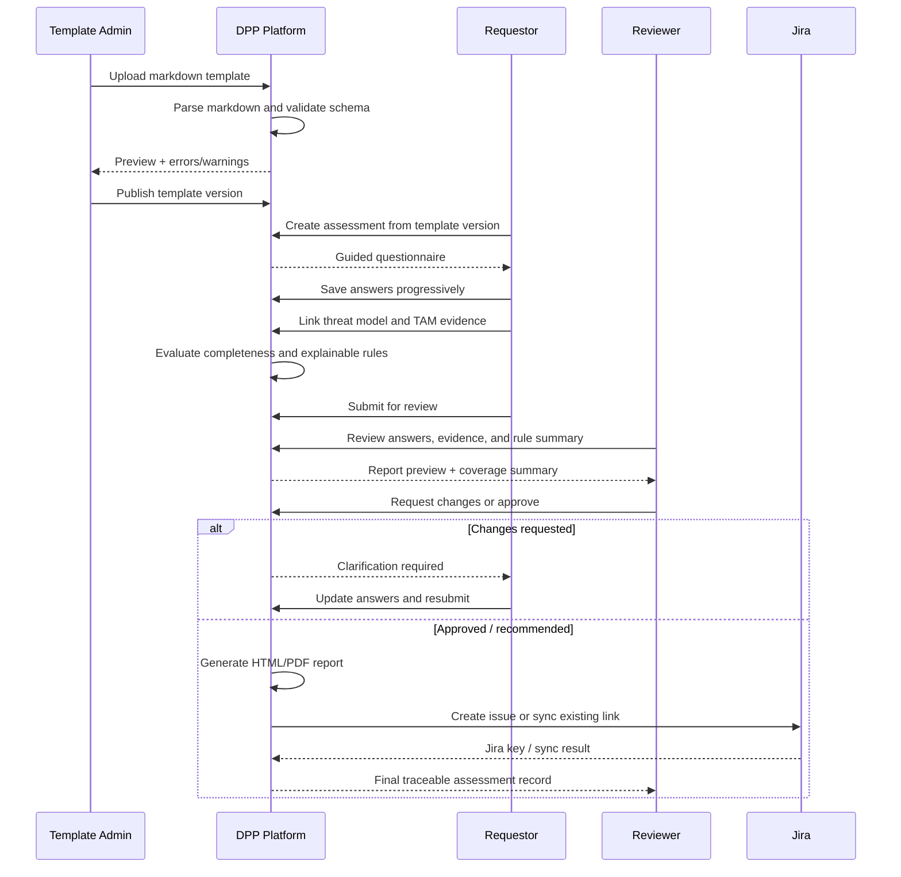

# DPP Assessment Flow Diagrams

## 1. End-to-End Lifecycle

```mermaid
flowchart TD
  A[Template admin uploads markdown template] --> B[Parser reads frontmatter, sections, questions, rules]
  B --> C[Validator checks schema, IDs, jurisdictions, conditions]
  C --> D{Template valid?}
  D -- No --> E[Return blocking errors and preview warnings]
  E --> A
  D -- Yes --> F[Publish immutable template version]
  F --> G[Requestor creates assessment]
  G --> H[Choose template version and jurisdiction(s)]
  H --> I[Capture scope metadata and Jira context]
  I --> J[Guided questionnaire renders from parsed markdown]
  J --> K[User answers questions with help, examples, and prompts]
  K --> L[Attach or link threat model and TAM evidence]
  L --> M[Completeness and consistency checks]
  M --> N{Ready to submit?}
  N -- No --> J
  N -- Yes --> O[Submit for review]
  O --> P[Privacy / security reviewer reviews answers and evidence]
  P --> Q{Changes needed?}
  Q -- Yes --> R[Return comments and clarification requests]
  R --> J
  Q -- No --> S[Generate HTML/PDF report]
  S --> T[Create or link Jira ticket]
  T --> U[Produce explainable DPP coverage summary]
  U --> V[Final reviewer recommendation / approval]
```

## 2. Swimlane Interaction Flow

```mermaid
flowchart LR
  subgraph Admin[Template Admin]
    A1[Upload markdown]
    A2[Review validation output]
    A3[Publish version]
  end

  subgraph Platform[DPP Assessment Platform]
    P1[Store raw markdown + checksum]
    P2[Parse markdown into template JSON]
    P3[Validate schema and logic]
    P4[Render guided assessment]
    P5[Run completeness / rule checks]
    P6[Generate report]
    P7[Sync Jira metadata]
  end

  subgraph Requestor[Requestor / Architect]
    R1[Create assessment]
    R2[Select jurisdiction and scope]
    R3[Answer guided questions]
    R4[Link threat model / TAM]
    R5[Submit assessment]
  end

  subgraph Reviewer[Privacy / Security Reviewer]
    V1[Review answers and evidence]
    V2[Request clarification]
    V3[Approve / recommend outcome]
  end

  subgraph Jira[Jira]
    J1[Create issue or link existing]
  end

  A1 --> P1 --> P2 --> P3 --> A2 --> A3 --> R1
  R1 --> R2 --> P4 --> R3 --> R4 --> P5 --> R5 --> V1
  V1 --> V2 --> R3
  V1 --> V3 --> P6 --> P7 --> J1
```



## 3. Sequence View


